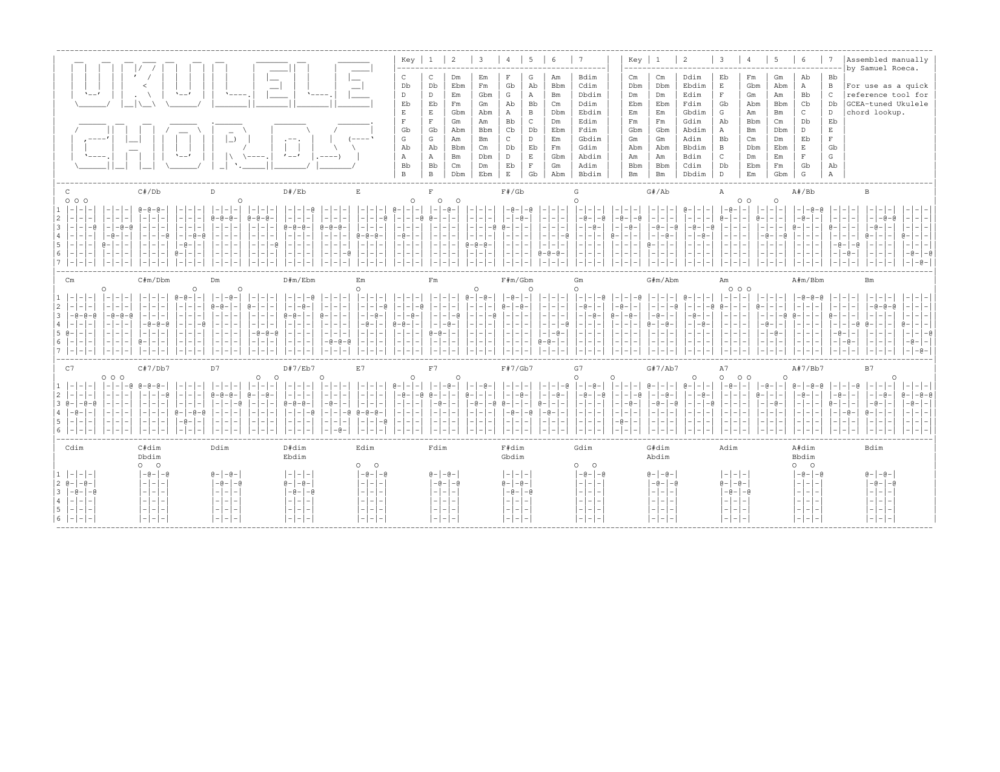

# Ukulele Utilities

I play the ukulele and like having quick references for chords / chord families. This repository contains these references. Intended for personal use.

## Chord Chart

[](https://github.com/pappasam/ukulele/blob/main/pdf/chords.pdf)

## Development

This was created on a laptop running Linux Mint. Dependencies can be installed with:

```bash
sudo apt install enscript ghostscript poppler-utils
```

To build, run:

```bash
make
```
